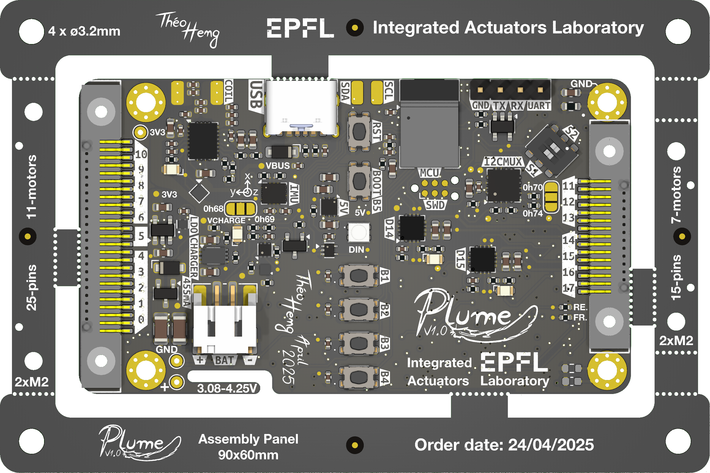
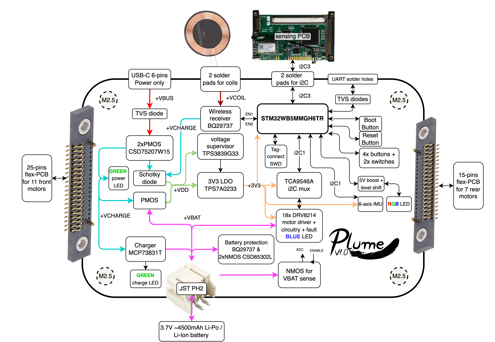
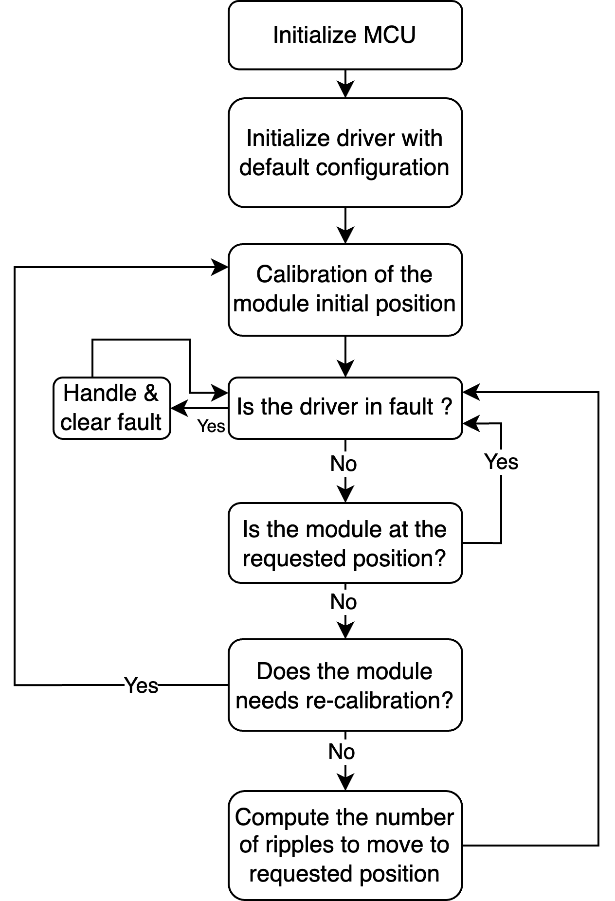

<p align="center" width="100%">
  <picture>
    <source media="(prefers-color-scheme: dark)" srcset="./Logos/Plume_logo_light.png">
    <source media="(prefers-color-scheme: light)" srcset="./Logos/Plume_logo_dark.png">
    
  </picture>
</p>

Plume was designed by Théo Heng for the Integrated Actuators Laboratory [(LAI)](https://www.epfl.ch/labs/lai/) in the context of a master semester project. The goal is to develop a microcontroller-based system to independently control a motor array in a reconfigurable insole designed for diabetic neuropathy patients, redistributing plantar pressure without the use of position sensors. 

This board is capable to drive and control in position up to 18 Brushed DC motors total and up to 9 simultaneously, without position sensors. This is achieved thanks to the ripple counting technique, integrated in the DRV8214 drivers. 

Plume also integrates multiple other features: 
- Automotive Grade Wireless Charging Qi (WPC v2.0) 
- USB-C charging
- Power Path between USB and Induction
- BLE 5.4
- Adressable RGB LED
- Power LED, Charge LED, Fault LEDs
- Exposed UART and I2C interface
- Tag-Connect 2030 for SWD + SWO
- Battery Protection and Voltage Supervisor
- 6-axis, High Performance, low power IMU
- Motion-Controlled Deep-Sleep mode
- I2C Multiplexer
- Accurate and Low-Power Battery Voltage Sensing

***

<p align="center" width="100%">
    
</p>

<p align="center" width="100%">
    
</p>

***

## SPECIFICATIONS

| Parameter | Plume V1.0 | 
| --- | --- |
| Working Battery Voltage Input | 3.08-4.25 V |
| Typ. Charge Current (USB, wireless)| 455 mA |
| Max. Allowed Charge Current | 2.27 A |
| Max. Continuous Discharge Current | 4.54 A |
| Theoretical Deep Sleep Power Consumption| 15 µA |
| Mass | 23.5g with the frame |
| Communication | UART / Trace Asynchronous (SWD) / I2C |
| MCU | STM32 WB5MMGH6TR |
| Dimensions | 70x40x9mm |
| Cost per PCB    | 39 CHF board + 75 CHF components + 125 CHF assembly ≈ 240 CHF / PCB    |
| Designer   | Théo Heng        |
| Supervisors   | Maël Dagon, Paolo Germano      |
| Development Period       | Feb. - May. 2025 |
| Project    | Smart Footwear for Diabetic Foot Care    |

***

## DIRECTORY STRUCTURE

```
Plume
├── Computations        # Computation sheets and simulations performed
├── Datasheets          # Datasheet of components
├── Images              # Pictures and screenshots used in schematics
├── lib
    |── 3d_models       # Component 3D models
    |── lib_fp          # Footprint libraries
    └── lib_sym         # Symbol libraries
├── Logos               # EPFL and Plume logos
├── Manufacturing
    |── Assembly        # BOM, assembly document
        |── bom.csv     # CSV BOM
        |── bom.html    # HTML BOM
        └── ibom        # HTML interactive BOM
    └── Fabrication     # zipped fabrication documents, and other generated documents by JLCToolkit Pluggin
├── Schematic           # PDF of schematic
├── Software            # Firmware of the Board
    |── PLUME_ESP32     # PlatformIO project for the ESP32-based prototype
    └── PLUME_STM32     # STM32CubeIDE project for the Plume PCB
├── STEP_BLENDER_STL    # Step, .pcb3d and stl files of the PCB and its casing
└── Templates           # Title block templates

```

***

## FIRMWARE

<p align="center" width="100%">
    
</p>

***

## CREDITS

Schematic template & project structure is hugely inspired by the work of Vincent Nguyen on its [Λ M U L E T](https://github.com/EPFLXplore/XRE_LeggedRobot_HW/tree/master/amulet_controller) controler.

***

## PHOTOS

<p align="center" width="100%">
    
</p>

<p align="center" width="100%">
    
</p>

<p align="center" width="100%">
    
</p>

<p align="center" width="100%">
    
</p>